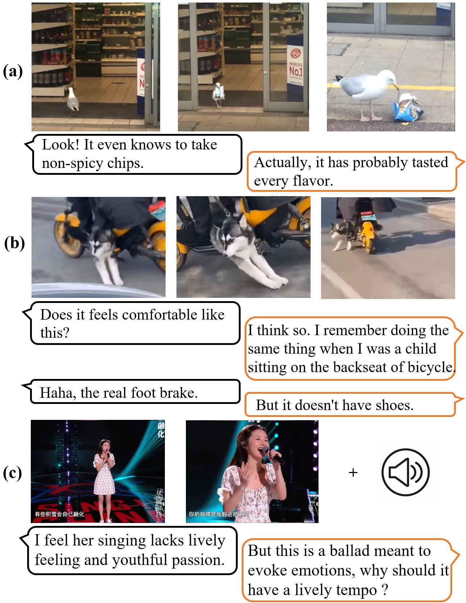

# TikTalk

## Introduction

TikTalk is a  multi-modal Chinese dialogue dataset introduced in [TikTalk: A Video-Based Dialogue Dataset for Multi-Modal Chitchat in Real World](https://arxiv.org/abs/2301.05880). It contains 38,703 videos and corresponding 367,670 dialogues in Douyin. Our dataset homepage is at [https://ruc-aimind.github.io/projects/TikTalk/](https://ruc-aimind.github.io/projects/TikTalk/).

Examples of dialogues from TikTalk dataset.

## Data Comparison

The comparison of main multi-modal dialogue datasets and their characteristics are present in the table below.

## Data Download

We provide a way to download our data. You can use [src/spider.py](./src/spider.py) and video ids to get the url for each video and use [src/download_videos.py](./src/download_videos.py) to download the videos.

You need to ensure that the data are used only for research purposes and are not redistributed to any third party. If the data are reproduced in electronic or print media, they may only be used in scientific journals with a copyright notice. Please fill in the [application form](./Application%20Form.pdf) and send it to aimindtiktalk@163.com and we will provide the download links the video ids and corresponding dialogue data.

## Lisense

The license of the collected dataset is [here](./LICENSE).
